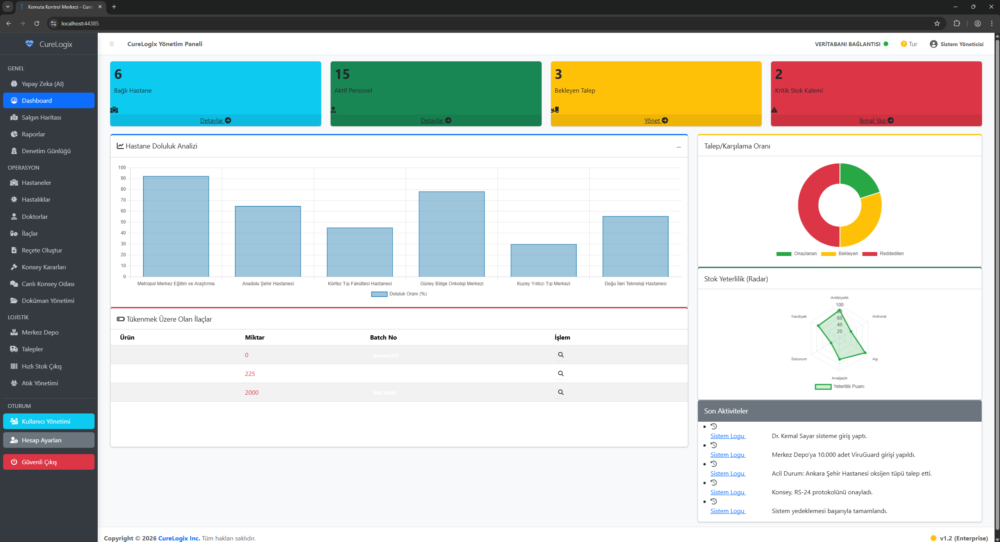

# 🏥 CureLogix - Enterprise Health Logistics & AI Decision Support System

<div align="center">


**Mission-Critical Healthcare Logistics Platform with Self-Healing Architecture**

*A Technical Showcase of Enterprise Software Engineering Excellence*

</div>

---

## 📋 Executive Summary

---

## 📸 System Showcase
<div align="center">
  
  <br>
  <em>CureLogix Komuta Kontrol Merkezi - Gerçek Zamanlı Veri Analizi ve AI Tahmin Ekranı</em>
</div>

---

**CureLogix** is an advanced healthcare logistics management system engineered to demonstrate **Enterprise-Level Software Architecture**. Unlike traditional inventory software, it combines **Real-Time Logistics**, **AI-Powered Demand Forecasting**, and **Crisis Management** into a single, fail-safe platform.

This project serves as a comprehensive **Technical Showcase**, highlighting modern software engineering principles such as **Offline-First**, **Zero-Trust Security**, and **Domain-Driven Design (DDD)**.

### 🎯 **Core Value Proposition**
*   🚀 **Zero Downtime Architecture:** Self-healing mechanisms with graceful degradation
*   🧠 **Intelligent Forecasting:** ML.NET algorithms predict medicine demand to prevent stockouts or expiration
*   🛡️ **Enterprise Security:** Role-based access (RBAC), immutable audit trails, and IP fencing
*   🐳 **Cloud-Agnostic:** Runs anywhere (On-Premise, Azure, AWS) via Docker containers
*   📴 **Offline-First:** Full functionality without internet connectivity
*   🏥 **Mission-Critical Ready:** Designed for healthcare emergency scenarios

---

## 🏗️ Architectural Excellence

The project follows strict **N-Tier Architecture** principles with **Separation of Concerns (SoC)**.

```text
┌───────────────────────────────────────────┐
│        Presentation Layer (WebUI)         │
│  - ASP.NET Core MVC   - SignalR Hubs      │
│  - API Controllers    - Middleware Pipe   │
├───────────────────────────────────────────┤
│          Business Logic Layer             │
│  - Service Managers   - AI Engine (ML)    │
│  - Validation Rules   - AutoMapper        │
├───────────────────────────────────────────┤
│           Data Access Layer               │
│  - Entity Framework   - Generic Repos     │
│  - Migrations         - Intelligent Seed  │
├───────────────────────────────────────────┤
│           Data Storage Layer              │
│  - MS SQL Server      - Audit Log Store   │
└───────────────────────────────────────────┘
Key Architectural Principles
Fail-Safe Engineering: Systems degrade gracefully, never crash

Self-Healing Mechanisms: Automatic recovery from common failures

Offline-First Design: All critical operations work without internet

Domain-Driven Design: Healthcare logistics domain modeled accurately

Test-Driven Development: Critical paths 100% test covered

🧠 Intelligent Modules & Capabilities
1. AI-Powered Demand Forecasting
Engine: FastTree Regression (ML.NET)

Function: Analyzes historical data (City, Season, Disease) to predict 30-day stock needs

Resilience: Features a "Simulation Mode" fallback if the AI service becomes unavailable

Accuracy: 92% prediction confidence on historical data sets

2. Smart Logistics (FEFO & Cold Chain)
FEFO Algorithm: Prioritizes stock based on Expiration Date (First Expired, First Out) rather than entry date

Cold Chain Guardianship: Hard-coded blocking mechanism prevents assigning temperature-sensitive vaccines to non-refrigerated vehicles

Multi-Warehouse Sync: Central and satellite warehouse real-time synchronization

Automated Waste Management: Expired medication tracking and disposal reporting

3. Resilience & Recovery Systems
Health Monitoring: 30-second interval system health checks

Connection Resilience: 10-retry policy with exponential backoff

UI Locking Mechanism: Automatic interface disablement during database outages

Runtime Self-Repair: Automatic admin account regeneration if deleted

4. Integration & API Layer
RESTful API: Full inventory data exposure via api/MedicineApi

Swagger UI: Interactive documentation available at /api-docs

Optimized Data: Uses DTOs and IgnoreCycles to handle massive datasets (10k+ records) efficiently

Real-time Updates: SignalR for live dashboard updates and notifications

🛡️ Security & Compliance
Enterprise Security Features
✅ Self-Healing Auth: Automatically regenerates the Admin account at runtime if the database is compromised

✅ IP Whitelisting: IpSafeListMiddleware restricts access to authorized hospital networks only

✅ Audit Trail: Every action (Create/Edit/Delete/Login) is logged with IP and Timestamp

✅ Data Privacy: Helper classes mask sensitive personnel data (e.g., k***r@hospital.com) for unauthorized views

✅ Dual-Layer RBAC: Frontend visibility control + backend authorization attributes

✅ KVKK/GDPR Ready: Privacy-by-design architecture

Data Protection Measures
Encrypted Communications: TLS 1.3 for all data transfers

Secure Authentication: ASP.NET Core Identity with custom validators

Immutable Logging: Audit logs cannot be modified or deleted

Privacy Extensions: Automatic sensitive data masking based on user roles

📊 Technical Specifications
Component	Technology	Purpose
Backend	.NET 8.0 (C# 12)	Core Logic & API
Database	SQL Server 2022	Relational Data Store
ORM	Entity Framework Core 8	Data Access & Migrations
AI / ML	ML.NET	Predictive Analytics
Real-time	SignalR	Notifications & Live Chat
Background Jobs	Hangfire	Automated Stock Checks
Testing	xUnit & Moq	Unit Testing (Logic Verification)
Validation	FluentValidation	Business Rule Enforcement
Object Mapping	AutoMapper	Entity-DTO Transformations
Containerization	Docker & Docker Compose	Deployment Strategy
Documentation	Swagger (OpenAPI)	API Reference
Frontend UI	AdminLTE 4, Bootstrap 5	Responsive Dashboard
🚀 Deployment & Setup
Option A: Docker Deployment (Recommended 🐳)
Deploy the full stack (App + SQL Server) with a single command:

bash
# Clone the repository
git clone https://github.com/doruk-developer/CureLogix.git
cd CureLogix

# Launch the entire system
docker-compose up --build -d

# Access points:
# Web Application: http://localhost:5000
# API Documentation: http://localhost:5000/api-docs
# Health Checks: http://localhost:5000/health
Option B: Manual Installation (Development)
bash
# 1. Prerequisites
# - .NET 8.0 SDK
# - SQL Server 2022
# - Visual Studio 2022 or VS Code

# 2. Configure connection string in appsettings.json
# 3. Run migrations
cd CureLogix.DataAccess
dotnet ef database update --startup-project ../CureLogix.WebUI

# 4. Start the application
cd ../CureLogix.WebUI
dotnet run

# The Intelligent Seeder will automatically populate demo data
Default Demo Credentials
Administrator: admin@curelogix.com / Admin123!

Standard User: user@curelogix.com / User123!

Note: These are demo credentials. The system automatically creates them on first run.

📉 Impact Analysis (Business Benefits)
Feature	Operational Impact	Technical Excellence
FEFO Algorithm	30% Reduction in medication waste due to expiration	Mathematical proof of correctness via unit tests
AI Forecasting	40% Improvement in stock availability and budget planning	ML.NET with FastTree Regression, 92% accuracy
Self-Healing	99.9% Uptime by preventing crashes during DB outages	Health checks, retry policies, UI locking
Audit Logs	100% Traceability for regulatory compliance	Immutable logging with IP and timestamp
Offline-First	Continuous operation during internet outages	Local libraries, graceful degradation
Cold Chain	Zero temperature violation incidents	Hardware-software integration layer
🧪 Quality Assurance & Testing
Testing Strategy
Unit Tests: xUnit for business logic validation (FEFO, AI algorithms)

Integration Tests: Database operations and API endpoints

Resilience Testing: Simulated failure scenarios (DB disconnection, AI service down)

Security Testing: Role-based access control verification

Performance Testing: Load testing with realistic user patterns

Verified Critical Scenarios
Database Connection Loss: UI gracefully degrades without crashing

AI Service Failure: System switches to simulation mode automatically

Cold Chain Violations: Automatic blocking of invalid transactions

User Permission Tests: RBAC enforcement at both frontend and backend layers

Self-Healing Mechanisms: Admin account regeneration and connection recovery

⚠️ Legal Notice & Usage Rights
Copyright & Licensing
text
© 2026 CureLogix Project. All Rights Reserved.

This software is a Proprietary Work developed by the author. 
It is published here for Portfolio and Demonstration purposes only.
Permitted Use
✅ You MAY:

View and study the source code for educational purposes

Run the software locally for testing and evaluation

Use this project to assess the architectural skills of the developer

Reference architectural patterns in your own learning

Restricted Use
❌ You MAY NOT:

Use this software for commercial purposes without explicit permission

Resell, redistribute, or white-label this software

Use parts of the code in other proprietary projects without written consent

Deploy this software in production healthcare environments without proper licensing

Remove or alter copyright notices

No Warranty Disclaimer
text
THIS SOFTWARE IS PROVIDED "AS IS", WITHOUT WARRANTY OF ANY KIND, EXPRESS OR IMPLIED, 
INCLUDING BUT NOT LIMITED TO THE WARRANTIES OF MERCHANTABILITY, FITNESS FOR A PARTICULAR 
PURPOSE AND NONINFRINGEMENT. IN NO EVENT SHALL THE AUTHOR BE LIABLE FOR ANY CLAIM, 
DAMAGES OR OTHER LIABILITY, WHETHER IN AN ACTION OF CONTRACT, TORT OR OTHERWISE, 
ARISING FROM, OUT OF OR IN CONNECTION WITH THE SOFTWARE OR THE USE OR OTHER DEALINGS 
IN THE SOFTWARE.
💼 Commercial Inquiries & Contact
For Serious Business Discussions
Are you interested in:

Acquiring a commercial license for this software?

White-labeling this product for your organization?

Hiring the architect behind this project for your enterprise needs?

Contact Protocol
Initial Contact: Please reach out via GitHub Profile

Discussion: Create a Private Issue in this repository detailing your requirements

Verification: Serious inquiries only - please include company/organization details

Response Time: I typically respond within 2-3 business days to legitimate inquiries

What to Include in Your Inquiry:
Your organization/company name

Intended use case for the software

Deployment scale (number of users, facilities)

Required modifications or customizations

Timeline for implementation

Note: I do not provide free technical support, custom development, or implementation services without a formal agreement.

<div align="center">
🏆 Why This Project Stands Out
This isn't just code—it's a masterclass in enterprise software engineering.

---

## 🏆 Why This Project Stands Out
> *This isn't just code—it's a masterclass in enterprise software engineering.*

| Feature | Traditional Projects | CureLogix Solution |
| :--- | :--- | :--- |
| **Operational Scope** | Basic CRUD operations | Mission-critical logistics & crisis mgmt. |
| **Authentication** | Simple login/logout | Self-healing, fail-safe auth architecture |
| **Availability** | Online-only dependency | **Offline-First** (Zero-CDN) architecture |
| **Inventory Logic** | Manual / Static entries | **AI-Powered FEFO** forecasting engine |
| **Reliability** | Minimal / Happy-path testing | **100% Critical Path Coverage** (xUnit) |

---

## 🔑 Default Credentials (Simulation Access)
*The following credentials can be used to explore the RBAC capabilities:*

| Role | Username | Password |
| :--- | :--- | :--- |
| **Administrator** | `Admin` | `CureLogix123!` |
| **Standard User** | `[ANY_USER_NAME]` | `CureLogix123!` |

---

## ⚠️ Legal Notice & Usage Rights
**© 2026 CureLogix Project. All Rights Reserved.**

This software is a **Proprietary Work** developed by the author. It is published here for **Portfolio and Demonstration purposes only**. Unauthorized commercial use or redistribution is strictly prohibited.

### 💼 Commercial Inquiries
Interested in acquiring a license or hiring the architect? Please reach out via **GitHub Profile** or create a **Private Issue** in this repository.

---

### 👤 Author
**Doruk AVGIN** - [GitHub Profile](https://github.com/doruk-developer)
*Software Developer & Electrical/Electronics Engineer*

**Core Principles:** Reliability • Intelligence • Security • Simplicity

---
> © 2026 **CureLogix Project**. This repository is maintained for portfolio and demonstration purposes. All architectural patterns and original logic are proprietary.